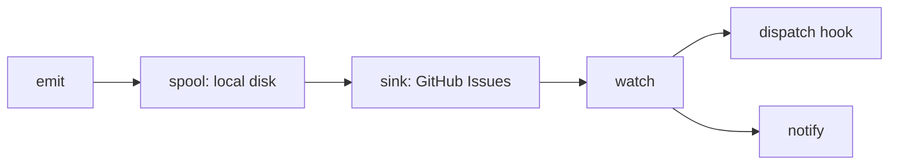

# errmeter

<div align="center">

**🇺🇸 English** ｜ [🇯🇵 日本語](https://github.com/caty-ai/errmeter/blob/main/docs/i18n/README.ja.md) ｜ [🇨🇳 简体中文](https://github.com/caty-ai/errmeter/blob/main/docs/i18n/README.zh.md) ｜ [🇹🇭 ไทย](https://github.com/caty-ai/errmeter/blob/main/docs/i18n/README.th.md)


[](https://github.com/caty-ai/errmeter/blob/main/LICENSE)


errmeter reports failed or silent AI agents and scheduled jobs, so unnoticed failures across machines reach a shared board and a repair hook.

**A shout that is never lost.**

🔧 [Engineering: architecture](https://github.com/caty-ai/errmeter/blob/main/docs/architecture.md) ｜ 📘 [Reference: contract](https://github.com/caty-ai/errmeter/blob/main/docs/contract.md)

[Sound familiar?](#pain) ｜ [What it does](#what) ｜ [What you need](#requirements) ｜ [Get started](#start) ｜ [Why it's safe](#safety) ｜ [Learn more](#more) ｜ [License](#license)

</div>

---

<a id="pain"></a>

## Sound familiar?

Running jobs on several machines makes silence easy to miss.

- A nightly job stopped a week ago, and you only noticed today.
- An agent failed at 3 a.m.; its error stayed on a machine you rarely open.
- Your laptop was asleep when it was supposed to watch the other agents.
- Someone said it was fixed, but nobody can trace what actually happened.

errmeter gives those machines one shared place to report what happened.

---

<a id="what"></a>

## What it does

An agent writes its report to local disk first; a forwarder delivers it when the network allows, and a watcher hands failures to your repair hook.



- 📣 **Emit** — report a failure or send an “I am alive” heartbeat.
- 💾 **Spool** — keep the report locally until delivery is acknowledged.
- 📮 **Sink** — forward reports to your private GitHub Issues board.
- 👀 **Watch** — claim failures, run your repair hook, and escalate to you.

Repeated errors share an Issue, so you can trace occurrences and repair outcomes. You supply the repair hook and notification settings; errmeter does not repair code by itself or merge repair PRs.

The disk-first design has limits: storage exhaustion can lose reports; overflow reduces detail, and its ceiling drops further occurrences. A host without a loop retries for a bounded linger period and at its next emit. If every machine is down, none can notify you. See [durability and loss boundaries](https://github.com/caty-ai/errmeter/blob/main/docs/contract.md).

That shared board needs only a runtime, a repository, and a narrowly scoped token.

---

<a id="requirements"></a>

## What you need

Start on one agent machine with these three things.

- **Node.js 18+** — no package dependencies, build step, or database.
- **A private GitHub repository** — for example, `owner/errmeter-inbox`.
- **A fine-grained token** — limited to that repository's Issues and metadata.

| Environment | Support | What to know |
| --- | --- | --- |
| macOS | ✅ Supported | Native launchd registration |
| Linux, user-scope systemd | ⚠️ Unverified | Starts at login; boot needs user lingering; real-host validation pending |
| Linux, system-scope systemd | ⚠️ Unverified | Requires validation on a real host |
| Windows | ⚠️ Unverified | Native Task Scheduler path; real-host validation pending |
| Node.js 18 / 20 / 22 / 24 | ✅ Local matrix | Tests run locally; no GitHub Actions |
| Any process that can run a command | ✅ Command interface | Call `errmeter emit` |
| Claude Code | ✅ Hook integration | Owner-applied hooks; see integrations |
| Codex | ✅ Notify integration | Owner-applied notify hook; see integrations |
| cron / launchd jobs | ✅ Job wrappers | Preserve the job's exit status |

The [local matrix policy](https://github.com/caty-ai/errmeter/blob/main/CONTRIBUTING.md) describes verification; the [integration index](https://github.com/caty-ai/errmeter/blob/main/docs/integrations/README.md) explains the owner tools. Monitoring needs `watch` on an always-on machine; an agent-only host can run the lighter `agent-host` loop.

With those prerequisites ready, install and send your first report.

---

<a id="start"></a>

## Get started

Install on one machine first, then connect its report to your private board.

### Ask your AI to install it

Paste this into the agent you use:

```text
https://github.com/caty-ai/errmeter
Install this with: npm install -g errmeter — then help me configure it.
If npm is missing, follow the README's prerequisites and install guidance.
```

The command is spelled out so your agent uses the intended npm package and install route.

### Install it yourself

Open a terminal and install the command:

```sh
npm install -g errmeter
errmeter --help
```

Create your private inbox repository first. Replace `<owner>/<inbox>` below with its name (for example, `owner/errmeter-inbox`); do not type the angle brackets.

```sh
errmeter init --repo <owner>/<inbox> --role agent-host
```

Save your fine-grained token in `~/.errmeter/github-token` as plain text, with file mode **0600** on macOS/Linux (only your user can read and write it). On Windows, use `%USERPROFILE%\.errmeter\github-token` and restrict its profile ACL to your user. Keep the token out of shell history, messages, and logs.

With that token in place, verify access. This check uses the network, creates the required labels, and creates and closes a probe Issue; it needs a valid token. Review the token's permission page yourself too: the probe cannot prove least privilege.

```sh
errmeter status --check
```

Save a small, non-sensitive log as `./last.log`, then send a report:

```sh
errmeter emit --agent my-agent --message "something broke" --detail-file ./last.log
```

The report is queued locally and delivery is attempted separately. Exit 0 does not confirm that the board received it. A fresh board can report degraded status because no watcher is known yet; finish the [watcher and heartbeat setup](https://github.com/caty-ai/errmeter/blob/main/docs/integrations/heartbeat.md) and configure your repair and notification hooks before relying on alerts.

<details>
<summary>Token setup, file location, or command not found?</summary>

A fine-grained personal access token is a GitHub credential whose repositories and permissions you choose. In GitHub's developer settings, select only your private inbox, **Issues: Read and write**, and **Metadata: Read**. No Contents or Pull requests permission is needed. See the [token boundary](https://github.com/caty-ai/errmeter/blob/main/docs/contract.md#8-token-and-permission-boundary-frozen).

The default home is `~/.errmeter` (`%USERPROFILE%\.errmeter` on Windows). If you set `ERRMETER_HOME`, put the token at the `sink.token_file` path in that home's `config.json`; `ERRMETER_GITHUB_TOKEN` takes precedence if set. A file permissions editor can set mode 0600 on POSIX systems; Windows uses profile access controls instead.

If npm is missing, install Node.js 18+ with npm using your operating system's installer or your existing Node version manager, then reopen the terminal. If `errmeter` is still not found, check that npm's global executable directory is on your `PATH`. A terminal is the application where you paste commands: Terminal on macOS/Linux, or PowerShell on Windows.

</details>

Once the first report is queued, check the boundaries before connecting more jobs.

---

<a id="safety"></a>

## Why it's safe

The [contract](https://github.com/caty-ai/errmeter/blob/main/docs/contract.md) defines these boundaries.

- **Your agent** — emit returns fast with exit 0; CLI misuse returns 2 (§11).
- **Your token** — inbox Issues and metadata only; review its permissions (§8).
- **Your logs** — a redacted tail leaves; known secrets are masked (§4).
- **Your choice** — `errmeter uninstall` removes boot registration (§11).
- **Your machine** — only `watch` runs long-term; no HTTP server (architecture §9).

The [owner hook tools also restore their backups](https://github.com/caty-ai/errmeter/blob/main/docs/integrations/README.md); uninstalling boot registration does not remove hooks or erase your records. No hosted server or paid CI is needed: laptops may run an `agent-host` loop or emit without one. Redaction is pattern-based, so review sensitive log content before forwarding it; repair hooks run as the watcher's OS user and need their own credentials.

**Not for you if** you have a single machine and a single agent, or you already have a paid monitoring stack that covers this need.

For configuration, operating limits, and contributions, use the references below.

---

<a id="more"></a>

## Learn more

Choose the reference for the next decision you need to make.

| What you want | Where to look |
| --- | --- |
| User stories and non-goals | [Requirements](https://github.com/caty-ai/errmeter/blob/main/docs/requirements.md) |
| Data flow and module map | [Architecture](https://github.com/caty-ai/errmeter/blob/main/docs/architecture.md) |
| Configuration, commands, and boundaries | [Contract](https://github.com/caty-ai/errmeter/blob/main/docs/contract.md) |
| Agent hooks, job wrappers, and heartbeats | [Integrations](https://github.com/caty-ai/errmeter/blob/main/docs/integrations/README.md) |
| Local tests and contribution process | [Contributing](https://github.com/caty-ai/errmeter/blob/main/CONTRIBUTING.md) |
| Private vulnerability reports | [Security policy](https://github.com/caty-ai/errmeter/blob/main/SECURITY.md) |
| README editions | [English](https://github.com/caty-ai/errmeter/blob/main/README.md) / [日本語](https://github.com/caty-ai/errmeter/blob/main/docs/i18n/README.ja.md) / [简体中文](https://github.com/caty-ai/errmeter/blob/main/docs/i18n/README.zh.md) / [ไทย](https://github.com/caty-ai/errmeter/blob/main/docs/i18n/README.th.md) |

---

<a id="license"></a>

## License

[MIT](https://github.com/caty-ai/errmeter/blob/main/LICENSE), so you can use, modify, and incorporate errmeter into your own tools under its notice and warranty terms.

<div align="center">

**Zero dependencies** ｜ **Node 18+** ｜ **No CI required**

</div>
