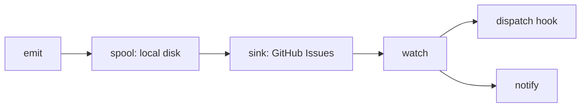

# errmeter

<div align="center">

[🇺🇸 English](https://github.com/caty-ai/errmeter/blob/main/README.md) ｜ [🇯🇵 日本語](https://github.com/caty-ai/errmeter/blob/main/README.ja.md) ｜ **🇨🇳 简体中文** ｜ [🇹🇭 ไทย](https://github.com/caty-ai/errmeter/blob/main/README.th.md)


[](https://github.com/caty-ai/errmeter/blob/main/LICENSE)


errmeter 用于上报失败或失联的 AI 代理和定时任务，让分散在各台机器上、原本无人察觉的故障能够汇总到一个共享看板，并触发你的修复钩子。

**永不消失的呼喊。**

🔧 [工程文档：架构](https://github.com/caty-ai/errmeter/blob/main/docs/architecture.md) ｜ 📘 [参考文档：契约](https://github.com/caty-ai/errmeter/blob/main/docs/contract.md)

[是不是很熟悉？](#pain) ｜ [它能做什么](#what) ｜ [你需要准备什么](#requirements) ｜ [快速上手](#start) ｜ [为什么安全](#safety) ｜ [了解更多](#more) ｜ [许可证](#license)

</div>

---

<a id="pain"></a>

## 是不是很熟悉？

在多台机器上运行任务时，"静默失败"很容易被忽略。

- 一个夜间任务一周前就停了，你今天才发现。
- 某个代理在凌晨 3 点失败，错误信息留在了你很少打开的那台机器上。
- 本该监控其他代理的笔记本电脑，当时正处于休眠状态。
- 有人说问题已经修好了，但没人能追溯到底发生了什么。

errmeter 为这些机器提供了一个共享的地方，用来上报发生的情况。

---

<a id="what"></a>

## 它能做什么

代理会先把报告写入本地磁盘；转发器会在网络可用时投递报告，监视器再把失败交给你的修复钩子。



- 📣 **Emit（上报）** — 上报一次失败，或发送一次"我还活着"的心跳。
- 💾 **Spool（暂存）** — 在投递被确认之前，把报告保存在本地。
- 📮 **Sink（转发）** — 把报告转发到你的私有 GitHub Issues 看板。
- 👀 **Watch（监视）** — 认领失败、执行你的修复钩子，并在必要时上报给你。

重复出现的错误会共用同一个 Issue，方便你追溯发生次数和修复结果。修复钩子和通知设置由你自己提供；errmeter 本身不会修复代码，也不会合并修复用的 PR。

"先写本地磁盘"的设计也有其局限：存储耗尽可能导致报告丢失；溢出时会削减细节，接近上限后会进一步丢弃后续发生的记录。没有常驻循环的主机会在有限的滞留期内以及下一次 emit 时重试投递。如果所有机器都处于离线状态，就没有任何一台能通知你。参见[持久性与丢失边界](https://github.com/caty-ai/errmeter/blob/main/docs/contract.md)。

搭建这个共享看板只需要一个运行环境、一个仓库，以及一个权限收窄的令牌。

---

<a id="requirements"></a>

## 你需要准备什么

先在一台代理机器上准备好以下三样东西。

- **Node.js 18 及以上版本** — 无需其他依赖包、构建步骤或数据库。
- **一个私有 GitHub 仓库** — 例如 `owner/errmeter-inbox`。
- **一个细粒度令牌（fine-grained token）** — 仅限该仓库的 Issues 和元数据权限。

| 环境 | 支持情况 | 需要了解的事 |
| --- | --- | --- |
| macOS | ✅ 已支持 | 原生 launchd 注册 |
| Linux（用户级 systemd） | ⚠️ 未经验证 | 登录时启动；开机启动需要用户 lingering；真机验证待完成 |
| Linux（系统级 systemd） | ⚠️ 未经验证 | 需要在真机上验证 |
| Windows | ⚠️ 未经验证 | 原生任务计划程序路径；真机验证待完成 |
| Node.js 18 / 20 / 22 / 24 | ✅ 本地矩阵测试 | 测试在本地运行，不使用 GitHub Actions |
| 任何可执行命令的进程 | ✅ 命令行接口 | 调用 `errmeter emit` 即可 |
| Claude Code | ✅ 钩子集成 | 由使用者自行配置钩子；详见集成文档 |
| Codex | ✅ 通知集成 | 由使用者自行配置通知钩子；详见集成文档 |
| cron / launchd 任务 | ✅ 任务包装器 | 保留任务原本的退出状态 |

[本地矩阵测试策略](https://github.com/caty-ai/errmeter/blob/main/CONTRIBUTING.md)说明了验证方式；[集成索引](https://github.com/caty-ai/errmeter/blob/main/docs/integrations/README.md)介绍了使用者可用的工具。监视功能（`watch`）需要一台常开的机器；仅运行代理的主机可以使用更轻量的 `agent-host` 循环。

准备好这些前提条件后，就可以安装并发送你的第一份报告了。

---

<a id="start"></a>

## 快速上手

先在一台机器上安装，再把它的报告接入你的私有看板。

### 让你的 AI 帮你安装

把下面这段内容粘贴给你正在使用的代理：

```text
https://github.com/caty-ai/errmeter
Install this with: npm install -g errmeter — then help me configure it.
If npm is missing, follow the README's prerequisites and install guidance.
```

这条指令写得很明确，以确保你的代理使用预期的 npm 包和安装方式。

### 自己动手安装

打开终端，安装该命令：

```sh
npm install -g errmeter
errmeter --help
```

先创建你的私有收件仓库。把下面的 `<owner>/<inbox>` 替换成实际名称（例如 `owner/errmeter-inbox`），不要输入尖括号本身。

```sh
errmeter init --repo <owner>/<inbox> --role agent-host
```

如果需要自定义的 HTTPS API 端点，使用 `init --api-base URL`（只有 localhost/127.0.0.1 允许使用 HTTP）；卸载以及安装/卸载的 dry-run 都不需要令牌，过时的安装记录会在 dry-run 预览中提示。Linux 上的用户状态探测进程只有在使用 `--check`，或某个已注册服务的状态处于 degraded（降级）时才会持续存在。

把你的细粒度令牌以纯文本形式保存在 `~/.errmeter/github-token` 中；在 macOS/Linux 上，文件权限设为 **0600**（只有你自己的用户能读写）。在 Windows 上，使用 `%USERPROFILE%\.errmeter\github-token`，并将该目录的访问控制限制为你自己的用户。不要把令牌留在 shell 历史记录、消息或日志中。

放好令牌后，验证一下访问是否正常。这项检查会使用网络、创建所需的标签，并创建再关闭一个探测用的 Issue；它需要一个有效的令牌。这个检查本身无法证明令牌遵循了最小权限原则，所以也请自行查看令牌的权限设置页面。

```sh
errmeter status --check
```

把一份不含敏感信息的小日志保存为 `./last.log`，然后发送一份报告：

```sh
errmeter emit --agent my-agent --message "something broke" --detail-file ./last.log
```

报告会先在本地排队，投递则是另外单独尝试的。退出码为 0 并不能确认看板已经收到报告。一个刚建好的看板可能会因为还没有已知的监视器而报告"降级（degraded）"状态；在依赖告警之前，请先完成[监视器与心跳设置](https://github.com/caty-ai/errmeter/blob/main/docs/integrations/heartbeat.md)，并配置好修复和通知钩子。

<details>
<summary>令牌设置、文件位置或命令找不到？</summary>

细粒度个人访问令牌（fine-grained personal access token）是一种由你自己选择仓库和权限范围的 GitHub 凭据。在 GitHub 的开发者设置中，只选择你的私有收件仓库，并勾选 **Issues: Read and write** 和 **Metadata: Read**。不需要 Contents 或 Pull requests 权限。参见[令牌权限边界](https://github.com/caty-ai/errmeter/blob/main/docs/contract.md#8-token-and-permission-boundary-frozen)。

默认的主目录是 `~/.errmeter`（Windows 上是 `%USERPROFILE%\.errmeter`）。如果你设置了 `ERRMETER_HOME`，请把令牌放在该主目录下 `config.json` 中 `sink.token_file` 指定的路径；如果设置了 `ERRMETER_GITHUB_TOKEN`，则优先使用它。POSIX 系统可以用文件权限编辑工具设置为 0600；Windows 则改用访问控制来实现同样的效果。

如果缺少 npm，可以用你操作系统自带的安装程序，或已有的 Node 版本管理工具安装 Node.js 18 及以上版本（含 npm），然后重新打开终端。如果 `errmeter` 仍然找不到，检查一下 npm 的全局可执行目录是否在你的 `PATH` 中。终端指的是用来粘贴命令的应用程序：macOS/Linux 上是 Terminal，Windows 上是 PowerShell。

</details>

第一份报告排队成功后，在接入更多任务之前，请先了解相关的边界限制。

---

<a id="safety"></a>

## 为什么安全

[契约文档](https://github.com/caty-ai/errmeter/blob/main/docs/contract.md)定义了以下边界。

- **你的代理** — emit 会快速返回退出码 0；CLI 使用错误时返回 2（§11）。
- **你的令牌** — 仅限收件仓库的 Issues 和元数据；请自行核查其权限设置（§8）。
- **你的日志** — 只发送经过脱敏的末尾片段；已知的敏感信息会被遮蔽（§4）。
- **你的选择** — 执行 `errmeter uninstall` 会移除开机注册（§11）。
- **你的机器** — 只有 `watch` 长期运行；不会启动 HTTP 服务（架构文档 §9）。

[使用者的钩子工具也会恢复各自的备份](https://github.com/caty-ai/errmeter/blob/main/docs/integrations/README.md)；卸载开机注册不会移除钩子本身，也不会清除你的记录。不需要托管服务器，也不需要付费 CI：笔记本电脑既可以运行 `agent-host` 循环，也可以不运行它、仅使用 emit。脱敏是基于模式匹配的，因此在转发之前请自行检查敏感日志内容；修复钩子以监视器所在的操作系统用户身份运行，需要自备相应的凭据。

**如果符合以下情况，errmeter 可能不适合你：** 你只有一台机器和一个代理，或者你已经拥有能覆盖这一需求的付费监控方案。

关于配置、运行限制和贡献方式，请参考下面的资料。

---

<a id="more"></a>

## 了解更多

根据你接下来要做的决定，选择对应的参考资料。

| 你想了解的内容 | 参考资料 |
| --- | --- |
| 用户故事与非目标 | [需求文档](https://github.com/caty-ai/errmeter/blob/main/docs/requirements.md) |
| 数据流与模块映射 | [架构文档](https://github.com/caty-ai/errmeter/blob/main/docs/architecture.md) |
| 配置、命令与各类边界 | [契约文档](https://github.com/caty-ai/errmeter/blob/main/docs/contract.md) |
| 代理钩子、任务包装器与心跳 | [集成文档](https://github.com/caty-ai/errmeter/blob/main/docs/integrations/README.md) |
| 本地测试与贡献流程 | [贡献指南](https://github.com/caty-ai/errmeter/blob/main/CONTRIBUTING.md) |
| 私密漏洞报告 | [安全策略](https://github.com/caty-ai/errmeter/blob/main/SECURITY.md) |
| README 各语言版本 | [English](https://github.com/caty-ai/errmeter/blob/main/README.md) / [日本語](https://github.com/caty-ai/errmeter/blob/main/README.ja.md) / [简体中文](https://github.com/caty-ai/errmeter/blob/main/README.zh.md) / [ไทย](https://github.com/caty-ai/errmeter/blob/main/README.th.md) |

<!-- family:generated:family-footer:start -->

---

本仓库属于 **Caty AI 家族** — 用于运营 AI 智能体家族的开源工具集。完整地图（包括仍在准备公开的模块）见 [Family OS](https://github.com/caty-ai/family-os)。

| 轴 | 模块 | 做什么 | 状态 |
| --- | --- | --- | --- |
| 地图 | [Family OS](https://github.com/caty-ai/family-os) | 整个家族的地图 — 模块、状态与结构 | 已公开・MIT |
| 规则 | [Family Dev Handbook](https://github.com/caty-ai/family-dev-handbook) | 开发的交通规则 — Issue、PR、worktree、交接与并行开发 | 已公开・MIT |
| 纵轴・基座 | [Caty Agent Harness](https://github.com/caty-ai/caty-agent-harness) | AI 智能体的任务基座 — 重试、检查点与完成判定 | 已公开・MIT |
| 纵轴 | [context-kit](https://github.com/caty-ai/context-kit) | 面向单个智能体的六件上下文卫生工具组 — 限制大输出、委托简报校验、安全防护、记忆检索、worktree 快照 | 已公开・MIT |
| 纵轴 | [Persona Engine](https://github.com/caty-ai/persona-engine) | 在智能体已有人格之上叠加关系与情感层 | 已公开・MIT |
| 纵轴 | [Persona Growth Loop](https://github.com/caty-ai/persona-growth-loop) | 让人格本身成长 — 以最小且幂等的提案 | 已公开・MIT |
| 纵轴 | [X Collector](https://github.com/caty-ai/x-collector) | 把 X 与网络素材汇成每日一份摘要 — 给人也给智能体 | 已公开・MIT |
| 纵轴 | [Self Growth Loop](https://github.com/caty-ai/self-growth-loop) | 让智能体自我成长的循环 — 提案、治理与采用记录 | 已公开・MIT |
| 横轴・基座 | [Family Memory Architecture](https://github.com/caty-ai/family-memory-architecture) | 记忆总线 — 家族共享所知的一层 | 已公开・MIT |
| 横轴 | [Sitter](https://github.com/caty-ai/sitter) | 替你盯着委派出去的智能体 — 监视、留证、仅在声明范围内重启 | 已公开・MIT |
| 横轴 | [Alpha Nightshift](https://github.com/caty-ai/alpha-nightshift) | 夜间自主维护循环 — 在默认拒绝的防护边界内运行夜间通道，早晨由人工挑选合并 | 已公开・MIT |
| 横轴 | **errmeter** | 上报跨机器失败或失联的 AI 代理与定时任务 — emit、spool、共享看板、修复钩子；永不消失的呼喊 | 已公开・MIT |
| 纵轴 | [Caty Gateway](https://github.com/caty-ai/caty-gateway) | CatyPhone 的电脑端网关 — 一行命令安装，把手机与本机运行的智能体（Claude Code / Codex CLI / OpenClaw / Hermes / OpenAI 兼容）连接起来 | 已公开・MIT |

<!-- family:generated:family-footer:end -->

---

<a id="license"></a>

## 许可证

[MIT](https://github.com/caty-ai/errmeter/blob/main/LICENSE) 许可证，你可以在其声明和保证条款下自由使用、修改 errmeter，并将其纳入自己的工具中。

<div align="center">

**零依赖** ｜ **Node 18+** ｜ **无需 CI**

</div>
