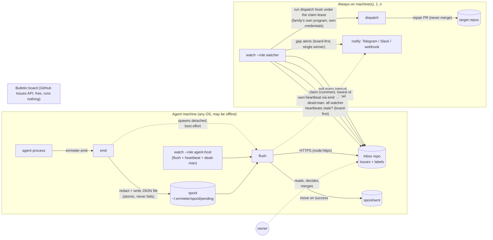

# errmeter architecture (v1)

Status: **frozen candidate v1.7** for contract-freeze issue #2. Companion: [requirements.md](requirements.md) (what and why), [contract.md](contract.md) (exact formats — where this file and contract.md differ, contract.md wins). Requirement ids (`R-*`, `N-*`) refer to requirements.md.

## 1. The one drawing



Three sides, one rule each:

| side | what it is | what it may know | what it must never do |
|---|---|---|---|
| **Agents shout** | any process, on any machine, running `errmeter emit` | the path of its own spool directory (and, read-only, the token file — only to *mask* it) | wait for the network, know who listens, use the token |
| **The board is paper** | the inbox repo's Issues, labels, comments, over the free REST API | nothing; it stores what it is given | run code, be billed, be the only copy of anything (spool is the durable original until delivered) |
| **Infrastructure looks, wakes, fixes, tells** | `errmeter watch` on any always-on box, in one of two roles | the board, the dispatch hook, the notify channels | merge anything, write to any repo other than the inbox, page the owner for something a repair handled |

## 2. The four layers and their boundaries

Every layer is one module directory under `src/` and talks to its neighbours only through the interfaces frozen in contract.md. Arrows are one-directional: nothing upstream imports anything downstream.

```
emit  ──▶  spool  ──▶  flush ──▶ sink (github-issue | file | webhook)
                                   ▲
                       watch ──────┘  (reads the board through the same sink adapter; adds claim / dispatch / heartbeat / notify)
```

### 2.1 emit (`src/emit`, `src/redact`)

- Input: flags (`--agent`, `--kind`, `--message`, detail from `--detail-file` / stdin, `--meta k=v`, `--task`) and local config (family, host).
- Work: build one event (contract §2), run the **redactor** over `task`, `message`, `detail`, `meta` values, compute the **fingerprint** (§2.1), hand it to spool.
- Mask list: emit reads the secret files it can read (board token, notify secrets) **only to add them to the mask list**; it never sends them and never opens a socket. If the files are unreadable, the mask list simply lacks them. Result: the spool on disk is already safe (N-9) whenever emit runs as the same user that owns the token.
- Then, unless `--no-flush`: spawn `errmeter flush` detached (`stdio: 'ignore'`, `unref()`), exit 0 immediately. The child takes the flush lock or exits silently.
- Capacity (contract §3.3): below the soft limit normal; between soft and hard limit *compact* events (no detail); at the hard limit one **appended line per occurrence** in a single overflow log (atomic small append, no lock, no new files). emit never refuses and never evicts.

### 2.2 spool (`src/spool`)

- One JSON file per event in `spool/pending/`, written as `.tmp` then renamed; moved (unlink-then-rename) to `spool/sent/` after the sink confirmed; `spool/dead/` only for unprocessable files, never for capacity.
- **Why one file per event, not one JSONL**: two agents on one host emit concurrently; `O_APPEND` is atomic only under `PIPE_BUF` and a redacted tail is often larger. Rename is atomic on all three OSes, needs no lock, and "sent/unsent" is "which directory" — visible with `ls`.
- Flush lock: `wx` create, refreshed every 30 s, stolen only via atomic rename of the stale file (contract §3.2) — never unlink-then-create, so two flushes cannot both win.
- Home unwritable → `<tmpdir>/errmeter-spool`, tagged; flush drains both (N-6).

### 2.3 flush + sink (`src/flush`, `src/sinks/*`, `src/http`)

- flush is short-lived: take the lock, list `pending/` oldest-first (≤ `max_events_per_pass`), group, call the sink:
  - heartbeats: newest per `agent@host` delivered; older ones straight to `sent/` (R-F4).
  - failures: grouped by fingerprint → one board write per group (create, or one occurrence comment), carrying **every delivered id in the marker** so a crash before the move is recovered by reading the board (contract §5.1).
  - overflow log: cut by rename, folded per fingerprint into one occurrence comment with the count, idempotent by the cut file's nonce.
- Then the **dead-man check** (§6 below). An emit-spawned flush that could not deliver **lingers** (keeps the lock, retries with backoff for up to `flush_linger_sec`, default 1 h) so a one-shot agent with no loop still gets automatic retry when the network returns; loop-driven flushes exit and rely on the next tick.
- The sink interface is the table in contract §5 (**those names are the only names**; this file does not restate them). Three adapters: `github-issue` (REST over `node:https`), `file` (JSONL with a `seq`, same host), `webhook` (POST, not a board).
- **Exactly one sink per config** (D-3). Human notification is `notify`, owned by watch (and used by flush only for the dead-man, board-first).
- **Why `node:https`, not global `fetch`**: on Node 18 `fetch` prints an `ExperimentalWarning` on first use, which would land in every agent's log. The brief's "via fetch" meant "plain HTTP, no `gh` binary", which this satisfies.

### 2.4 watch (`src/watch`, `src/claim`, `src/heartbeat`, `src/dispatch`, `src/notify`)

One `setTimeout` loop, one tick every `interval_sec`. Two roles, same process, same `install`:

| step | `--role watcher` | `--role agent-host` |
|---|---|---|
| 1. flush own spool (includes the dead-man check) | yes | yes |
| 2. `emit --kind heartbeat --agent watcher/<id>` with `meta.role` | yes (`watcher`) | yes (`agent-host`) |
| 3. list eligible failures (contract §6.1 rule 4) | yes | — |
| 4. claim → dispatch under the lease → outcome | yes | — |
| 5. gap check on all heartbeat records (marker `ts`, per-agent gap) → `upsertAlert` → notify only if winner | yes | — |
| 6. escalate after `escalate_after` consecutive failures → `needs-human` + one alert | yes | — |

- Dispatch runs **under the claim lease**: the watcher spawns a tiny **runner** (`errmeter _run`) that is the hook's parent and holds an absolute deadline `expires − kill_grace`; the runner kills the hook at that deadline (or at `timeout_sec`, whichever is first) **even if the watcher has died**. Renew every `renew_sec` (confirmed 2xx only) pushes the deadline forward; a failed renew kills the hook at once. An orphan therefore always dies before anyone else can take the claim. The runner is a process-group leader (POSIX) / uses `taskkill /T` (Windows).
- Errors inside the loop are logged, emitted as the loop's own failure events, and never stop the loop.
- `agent-host` is how a laptop or an agent-only VPS participates in liveness without being a repairer: it gives the dead-man a periodic trigger that is independent of the watchers (§6). `install --role agent-host` registers exactly this.

`watch` is the **only** long-running process in the system; `install` (#6) registers this one process (in one role) with launchd / systemd / Task Scheduler.

**Scan window mechanics:**

- `<home>/state/scan_cursor.json` stores the reference after which the next tick's scan starts as `{ "ref": <reference> }`, written via temporary file and rename. If that reference is missing from the current candidates, the watcher ignores it and removes the stale cursor.
- Starting after the cursor, the window follows ascending reference order and wraps at the end. A fully confirmed window advances the cursor to its last reference; a partial window normally advances only through its contiguous confirmed prefix. A detail read that throws is counted as scanned for this purpose, remains fail-closed, and advances the next tick past that row. Pending eligible claims take precedence: if a confirmed eligible row cannot claim because the remaining tick budget cannot admit a complete election, the scan stops and leaves the cursor at that row's logical predecessor so the next tick retries it first with a fresh budget. After success, ordinary ring traversal resumes and revisits deferred rows. The first incomplete tick reports `lookup_incomplete` and does not allocate a fresh claim budget within that tick.

#### Tick summaries

The JSON summary contains `ts`, `role`, `flush`, `eligible`, `claimed`, `pending_remaining`, `dispatched`, `gaps`, `scanned`, `unscanned`, `lookup_incomplete`, and `errors`, plus `dispatch_failed` when a dispatch fails. The text summary reports `role`, `flush`, `eligible`, `claimed`, `dispatched`, `gaps`, `scanned`, and `unscanned`; when errors exist it appends `errors=` with their messages on the same line.

If an eligible claim remains pinned for retry because the API budget cannot elect even one claim, the tick reports `watch: api budget too small to elect one claim (max_api_calls_per_pass=<n>, minimum=<m>, lower bound for single-page listings)`. The parseable `minimum=<m>` is the lower bound `max_pages_per_list + 7` (17 by default) for single-page listings: one listing call, two detail calls, two claim preflight calls, and the claim completion reserve required by contract §5.4. Multipage listing or detail reads may require more, so a budget equal to this lower bound is not guaranteed to suffice for every board. The error is recorded in every stalled tick's JSON summary, `last_watch.json`, and text line, so `--once` exits nonzero; logging and the watcher's self-`emit` happen only once per process context. A new process reports those side effects again. Watcher budgets below `max_pages_per_list + 7` are rejected at startup (contract §5.4/§7, #28), so the zero-scan band (≤ 11 at the default page cap) can no longer be configured for a watcher. The runtime stall message remains for multipage boards whose real requirement exceeds that lower bound.

A non-budget detail-read failure records the first concrete error with its issue reference and continues scanning. Additional failures produce one `watch: N further detail reads failed this tick` diagnostic, bounding detail-read reporting to two errors per tick while retaining cursor progress and gap checks.

## 3. Identity and secrets

- **Agent identity** = `agent` (lower-cased logical name) + `host`. Displayed `agent@host`.
- **Loop identity** = `watcher/<watcher_id>` for both roles; `meta.role` tells them apart.
- **Board token** (contract §8): fine-grained PAT, inbox repo only, Issues read/write + Metadata read. From env or a `0600` file. Added to the mask list at load. **Never passed to the hook** — the hook's environment is an allowlist (`pass_env`), not inherited.
- **Notify secrets**: file-only (`*_file`, `0600`). Never via env, so they cannot be inherited by anything.
- **Dispatch credentials** are the family's own (X-4). errmeter passes the event, not its token. This is what makes "PR only, never merge" structural: errmeter's token cannot write outside the inbox.
- Everything errmeter writes anywhere (board, log, outcome comments including hook stderr excerpts) passes the redactor (contract §4).

## 4. Failure behaviour

| situation | what happens | what does not happen |
|---|---|---|
| **GitHub unreachable / 5xx / rate-limited** | emit still succeeds. flush leaves events pending, records the error and the backoff in `state/last_flush.json`, exits. Retry on the next emit, the next `agent-host`/`watcher` tick, or a manual `flush`. | Loss. Duplicate Issue on retry (markers carry every id; lookup is fail-closed on incomplete listings). |
| **Crash between "board write" and "moved to sent/"** | Next flush finds the ids in the Issue/occurrence marker and moves the files without writing. | Duplicate comment. |
| **Two hosts create the same fingerprint at once** | Both Issues exist briefly; the next flush that lists them closes the higher number as `duplicate-of` and caches the lower. | Two long-lived Issues for one problem. |
| **All watchers down** | Watcher heartbeat markers stop advancing. Every flush (any host, either role) runs the dead-man check (§6). The alert is board-first with a single winner, so N hosts → 1 notification per `renotify_sec`. The alert Issue also @mentions the owner (GitHub notification, no secret needed). | Alert storms. False alert when the family has *no* watcher records yet (empty set → no alert; `status` reports "no watcher known"). |
| **Whole family dead** (no host runs any loop or emits) | Nothing. Accepted limit X-3; heartbeat Issues have stable titles for an external pinger. | — |
| **Spool grows (storm / long outage)** | Compact mode above the soft limit, counter mode at the hard limit (contract §3.3). Board writes bounded by grouping + `max_comments_per_issue_per_hour` (shared via marker timestamps). | Disk full (bounded by `hard_limit × 32 KiB` + `overflow_max_bytes`; beyond the ceiling counts are dropped and an alert says so — the one documented loss boundary). Silent eviction of unsent events. Rate-limit lockout (per-pass budget). |
| **Dispatch hook hangs / dies** | Killed at `timeout_sec` or at the lease fence; outcome `dispatch-failed`. After `escalate_after` consecutive failures → `needs-human` + one owner alert. | Infinite retries. Two hooks on one Issue (fence + `timeout ≤ ttl − grace`). |
| **Watcher dies mid-dispatch** | The runner kills the hook at the absolute deadline `expires − grace`. The claim expires at `expires`; another watcher takes over. Worst case: a gap of `claim_ttl_sec`, never an overlap. On restart the watcher kills any pid recorded in `state/dispatch/`. | Overlap. Stuck Issue. |
| **Repeated failed repairs** | Consecutive `dispatch-failed` outcomes are counted across occurrences (only a `repaired` outcome resets them); at `escalate_after` the Issue gets `needs-human` and the owner is alerted once. | An Issue that fails forever without paging anyone. |
| **Very chatty Issue** | At `max_comments_per_issue` flush rolls the Issue over (close + new Issue with `continues=`), so claim reads always stay within the pagination budget. | Permanently incomplete comment reads → dispatch silence. |
| **Two watchers claim together** | Both post; both re-read (full pagination); lowest comment id wins; the loser deletes exactly its own comment. | Split-brain. Deleting the winner's comment. |
| **Clock drift between hosts** | Expiry is judged by board time (`Date` header), not local clocks. | Premature takeover. |
| **Token missing / wrong scope** | `init --check` / `status --check` fail loudly naming the failing probe; over-scope is a warning; least privilege is confirmed by the human checkpoint #2. emit unaffected. | A silent system: `status` shows "last successful flush: never / N pending". |
| **Config missing** | emit works with defaults. flush/watch refuse to start with a one-line message pointing at `errmeter init`. | emit failing because of config. |

`removeStaleClaimedLabel` treats `errmeter:claimed` as advisory: marker/comment claim state is authoritative. Its read followed by label removal has an intentional time-of-check/time-of-use race. A delayed label write after claim expiry or release can leave a stale advisory label, which a later eligible tick removes. A claimant that adds the label before cleanup can have its current advisory label removed; the next tick does not necessarily restore it. Both outcomes are harmless to claim safety because marker/comment claim state is authoritative and labels never govern dispatch.

## 5. Where things live on disk

`ERRMETER_HOME` → else `~/.errmeter` (`%USERPROFILE%\.errmeter` on Windows); same layout everywhere.

```
~/.errmeter/
  config.json            family config (no secrets)
  github-token           board token, 0600 — or ERRMETER_GITHUB_TOKEN
  telegram-token …       notify secrets, 0600, file-only
  spool/
    pending/             not yet delivered (one JSON per event; counters.log + heartbeat-*.json in counter mode)
    sent/                delivered, kept sent_retention_days
    dead/                unprocessable only, kept dead_retention_days
    flush.lock           holder pid/nonce/ts; stolen only via atomic rename
  state/
    fingerprints.json    fp → { ref, state } cache
    last_flush.json      last attempt / success / error / backoff-until / lookup_incomplete
    alerts.json          local cache of alert episodes (board is authoritative)
    dispatch/<issue>.json  payload + pid of a running hook (restart cleanup)
  errmeter.log           errmeter's own log, redacted, size-rotated
```

## 6. Dead-man switch, precisely

"Who watches the watchers" is the brief's central worry. v1 answers it in three parts:

1. **Trigger**: the check runs inside every `flush`, and flush runs (a) after every `emit`, (b) every tick of any `watch` loop in either role. A family therefore has a periodic trigger that does not depend on the watchers as long as **at least one `agent-host` loop or one emitting agent** is alive. The detection latency bound is `max(interval of surviving loops, heartbeat cadence of surviving agents) + watcher_gap_sec`.
2. **Decision**: list heartbeat records with `role=watcher`; if the set is **empty → no alert** (a family that never had a watcher is not "all watchers dead"; `status` says "no watcher known"); if every record's marker `ts` is older than `watcher_gap_sec` → alert key `all-watchers-silent`.
3. **Single winner**: `upsertAlert` posts an episode comment on the alert Issue, re-reads, and only the lowest-id episode within `renotify_sec` notifies (contract §5.3). The alert Issue @mentions the owner, so even a family with no notify channel gets a GitHub notification.

The chain that must hold for the owner to be paged: *some loop or agent is alive* → *its flush reaches the board* → *notify works*. Each link is either what the system already guarantees (spool + retry + board-first dedup) or a config the owner tested once with `errmeter status --check --notify-test`. If nothing in the family is alive, nobody shouts (X-3).

## 7. Decisions on the six open questions

| # | question | decision | why |
|---|---|---|---|
| **D-1** | Emit JSON schema and versioning | Flat object; integer `schema` (1); `id` UUID v4; closed `kind`; lower-cased `agent`/`host`; `fingerprint` + `fpv`; `meta` string→string. Unknown fields ignored; unknown-higher `schema` delivered verbatim with a note. Contract §2. | A flat object is what a shell one-liner can produce and a human can read on the Issue. Versioning the fingerprint separately (`fpv`) lets the folding rule evolve without touching the event schema. |
| **D-2** | Spool location and rotation | Single home on all OSes; one file per event; compact → counter modes instead of eviction; `dead/` only for unprocessable. Contract §3. | Same path on three OSes is the sitter way. One-file-per-event gives atomic concurrent emits without locks. Never evicting unsent events keeps "nothing lost below the hard limit" honest; counters keep the *count* honest above it. |
| **D-3** | Sink config (env vs file) and multiple sinks | One JSON config file; env only for `ERRMETER_HOME/CONFIG/AGENT/GITHUB_TOKEN/LOG_LEVEL`; notify secrets file-only; **exactly one sink**; human channels are `notify`. Contract §7. | Multiple sinks turn "is it sent?" into a matrix. The real need is "board + tell a human", which `notify` covers. File-only notify secrets close the env-inheritance leak. |
| **D-4** | Claim protocol and staleness | Comment-based claim, lowest comment id among fully paginated comments wins; board-time expiry; renew confirmed-only; **fence**: hook killed on failed renew or at `expires − grace`; `timeout ≤ ttl − grace`; `repaired`/`dispatch-failed` records are eligible again only after a new occurrence. Contract §6. | Assignee cannot distinguish watchers sharing one token; labels have no author/time. Comments are append-only with an id and a body a human can read. The fence + timeout inequality turns "two hooks" from a race into an impossibility, at the cost of a bounded gap. |
| **D-5** | Dispatch hook contract | argv array, no shell, own process group; env is an **allowlist** plus `ERRMETER_*` (no token, no home); payload on stdin and in a file with the full `latest` event inline; exit 0 + last stdout line = outcome; all hook output redacted before it reaches the board. Contract §9. | stdin + file covers both scripting styles; the allowlist makes secret inheritance impossible rather than unlikely; inline `latest` lets a remote watcher rebuild the event from the board alone. |
| **D-6** | Auto-fix boundary | **PR only.** Hook MUST NOT merge; errmeter enforces its own half (inbox-only token) and records `repaired` as "proposed". Closing the Issue is human. | Owner decision. A wrong auto-merge costs more than the minutes a human spends approving. |

## 8. Module map (for the child issues)

| child | modules | depends on contract sections |
|---|---|---|
| #3 emit + spool | `src/emit`, `src/redact`, `src/spool`, `bin/errmeter.js` | §2, §3, §4, §10, §11 |
| #4 sink + flush | `src/flush`, `src/sinks/{github-issue,file,webhook}`, `src/http`, dead-man check (§6 here, contract §5.3) | §3.2, §5 (all), §7, §8 |
| #5 watch + claim + heartbeat + dispatch | `src/watch` (both roles), `src/claim`, `src/heartbeat`, `src/dispatch`, `src/notify` | §5, §6, §7, §9 |
| #6 install | `src/install`, `src/platform/{launchd,systemd,schtasks}` + the three platform branches (token mode check, process-tree kill, boot registration) | §7, §8, §9, §11 |
| #7 Node matrix | `scripts/test-matrix.*` | §10 list A |
| #8 family integration | `docs/integrations/*`, `tools/host-hooks/*` | §2, §9 boundary, §11 |
| #9 publication | README*, community files, `package.json` | — |

## 9. What this architecture deliberately does not have

- No daemon other than `watch` (two roles, one process type); no sockets; no HTTP server (X-7).
- No database; the board is the index, the spool is the queue, small JSON files are caches.
- No plugin loader. Three sinks, three notifiers; a family that needs another sends a PR.
- No per-agent registration on the board; agents exist when they first shout or heartbeat.
- No metrics (X-2). Export the Issues if you need graphs.
