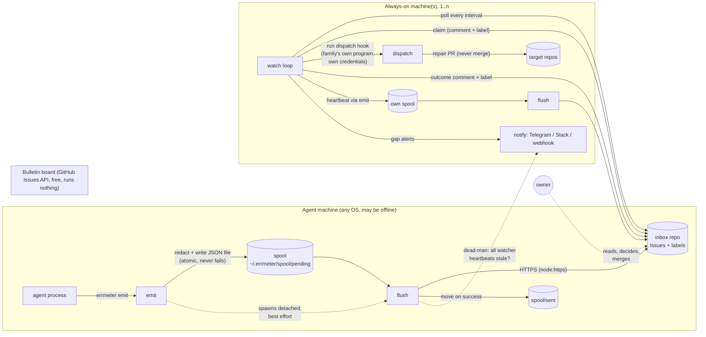

# errmeter architecture (v1)

Status: **frozen candidate** for contract-freeze issue #2. Companion: [requirements.md](requirements.md) (what and why), [contract.md](contract.md) (exact formats). Requirement ids (`R-*`, `N-*`) refer to requirements.md.

## 1. The one drawing



Three sides, one rule each:

| side | what it is | what it may know | what it must never do |
|---|---|---|---|
| **Agents shout** | any process, on any machine, running `errmeter emit` | the path of its own spool directory | wait for the network, know who listens, hold the board token to *read* anything |
| **The board is paper** | the inbox repo's Issues, labels, comments, edited over the free REST API | nothing; it stores what it is given | run code, be billed, be the only copy of anything (spool is the durable original until delivered) |
| **Infrastructure looks, wakes, fixes, tells** | `errmeter watch` on any always-on box (VPS, a spare Mac, a NAS) | the board, the dispatch hook, the notify channels | merge anything, write to any repo other than the inbox, page the owner for something a repair handled |

## 2. The four layers and their boundaries

Every layer is one module directory under `src/` and talks to its neighbours only through the interfaces frozen in [contract.md](contract.md). Arrows are one-directional: nothing upstream imports anything downstream.

```
emit  ──▶  spool  ──▶  flush ──▶ sink (github-issue | file | webhook)
                                   ▲
                       watch ──────┘  (reads the board through the same sink adapter, plus claim/dispatch/heartbeat/notify)
```

### 2.1 emit (`src/emit`, `src/redact`)

- Input: command-line flags (`--agent`, `--kind`, `--message`, detail from `--detail-file` / stdin, `--meta k=v`, `--task`) and the local config (family, host).
- Work: build one event object ([contract §2](contract.md)), run the **redactor** over `message`, `detail`, and every `meta` value, compute the **fingerprint**, and hand the object to spool.
- Then, unless `--no-flush`: spawn `errmeter flush` as a **detached child** (`stdio: 'ignore'`, `unref()`), and exit 0 immediately. The flush child takes the flush lock; if another flush already holds it, the child exits silently.
- emit never opens a socket, never reads the token, never blocks on the child.
- **Why redact here and not at flush**: the spool on disk is then already safe (N-9); a stolen laptop or an over-broad backup leaks nothing the board would not have shown. It also means the redactor runs in the agent's context, where the most sensitive strings (that agent's own tokens in its own env) are known and can be masked exactly. (Flush masks again as a second line of defence.)

### 2.2 spool (`src/spool`)

- One JSON file per event: `~/.errmeter/spool/pending/<ts>-<id>.json`, written as `.tmp` then renamed. Successfully delivered events are moved to `spool/sent/` (kept for a retention window, then deleted). Events the sink permanently refuses (e.g. schema it cannot parse) go to `spool/dead/`.
- **Why one file per event rather than one append-only JSONL file**: two agents on the same host (Claude Code and Codex, or two sitter jobs) emit concurrently. `O_APPEND` is atomic only for writes under `PIPE_BUF` (4 KiB on Linux) and a redacted tail is often larger; interleaved partial lines would corrupt the log. Rename is atomic on all three OSes, needs no lock, no cursor file, and "sent/unsent" becomes "which directory is it in" — visible with `ls`. Storm size is bounded by N-7 caps, so file count stays in the thousands at worst.
- spool never talks to the network and never reads config other than the home path. If the home is unwritable it falls back to `<os.tmpdir()>/errmeter-spool` (N-6) and records the fallback in the event's `meta._spool_fallback`.

### 2.3 flush + sink (`src/flush`, `src/sinks/*`)

- flush is a **short-lived process** (spawned by emit, run by `watch` on its own tick, or run by hand). It takes the flush lock, lists `pending/` oldest-first, groups events, and calls the sink adapter:
  - heartbeats: keep only the newest per `agent@host`; deliver it; move the older ones straight to `sent/` (R-F4).
  - failures: group by fingerprint; for each group deliver **one** board write (new Issue, or one comment on the existing open Issue with the folded count) (R-F3).
- The sink adapter interface is minimal ([contract §5](contract.md)): `deliverFailureGroup`, `deliverHeartbeat`, and for watch: `listOpen`, `claim`, `renewClaim`, `release`, `writeOutcome`, `listHeartbeats`. Three adapters ship in v1:
  - `github-issue` — Issues REST API over `node:https`. Fingerprint marker in the Issue body makes lookup deterministic; a local cache (`state/fingerprints.json`) avoids listing on the hot path.
  - `file` — appends to a JSONL file. For families without GitHub or for tests. `watch` on a `file` sink is supported on the same host only (no cross-host claims; the file is the board).
  - `webhook` — POSTs each event to one URL. For families that already have a collector. Not a board: `watch` cannot run against it.
- **Exactly one sink per config** ([decision D-3](#7-decisions-on-the-six-open-questions)). Human notification is not a sink; it is `notify`, owned by watch (and by flush for the dead-man only).
- **Why `node:https` and not global `fetch`**: on Node 18 `fetch` prints an `ExperimentalWarning` to stderr on first use, which would show up in every agent's log; `node:https` is stable on 18 and needs no flag. The design brief's "via fetch" meant "plain HTTP, no `gh` binary", which this satisfies.

### 2.4 watch (`src/watch`, `src/claim`, `src/heartbeat`, `src/dispatch`, `src/notify`)

One loop, `setTimeout`-driven, one tick every `interval_sec` (default 60):

1. **Flush own spool** (so watcher heartbeats and any local failures go out).
2. **Heartbeat** — `emit --kind heartbeat --agent watcher/<watcher_id>` (R-W5).
3. **Poll**: list open failure Issues that carry no terminal label and whose claim is absent or stale ([contract §6](contract.md)).
4. **Claim** each candidate (up to `max_concurrent`, default 1) with the deterministic protocol; on win, add label `claimed`, then **dispatch**: spawn the configured hook with the event as JSON on stdin and in a file, with a timeout, renewing the claim every `renew_sec` while it runs. Write the outcome back (`repaired` / `dispatch-failed` label + comment with the hook's last stdout lines) (R-W2, R-W3).
5. **Gap check**: read heartbeat Issues; for every agent whose `updated_at` is older than its gap (per-agent override or default), raise a gap alert once per episode through `notify`; when the agent comes back, post a recovery note (R-W4).
6. **Escalate**: failures whose dispatch failed `escalate_after` times (default 2) get label `needs-human` and one owner notification (R-O1).
7. Sleep until the next tick. Errors inside the loop are logged, emitted as the watcher's own failure events, and never stop the loop.

`watch` is deliberately the **only** long-running process in the system. `install` (#6) registers exactly this one process with launchd / systemd / Task Scheduler.

## 3. Identity and secrets

- **Agent identity** = `agent` (logical name: `nora`, `doc`, `claude-code`, …) + `host` (default `os.hostname()`, overridable in config). Displayed as `agent@host`.
- **Watcher identity** = `watcher/<watcher_id>`; `watcher_id` defaults to `host`. It is an agent like any other for heartbeats.
- **Board token** ([contract §8](contract.md)): a GitHub fine-grained personal access token with access to **only the inbox repo**, permissions **Issues: read/write, Metadata: read**. Loaded from `ERRMETER_GITHUB_TOKEN` or from `token_file` (default `~/.errmeter/github-token`, must be mode `0600` on POSIX; errmeter refuses a group/other-readable file). The token string is added to the redactor's mask list at load time so it can never echo back.
- **Dispatch credentials** are not errmeter's business. The hook is the family's program (a script that runs Codex / Claude Code / whatever) and uses whatever credentials that program has. errmeter passes the event, not its token (X-4). This is what makes "PR only, never merge" enforceable: errmeter's token cannot write to target repos at all.
- **Notify secrets** (Telegram bot token, Slack webhook URL) live in files referenced from config the same way as the board token (`*_file` keys, `0600`), or in env.

## 4. Failure behaviour

| situation | what happens | what does not happen |
|---|---|---|
| **GitHub unreachable / 5xx / rate-limited** | emit still succeeds (writes spool). flush fails the request, leaves the event in `pending/`, records the error in `state/last_flush.json`, exits. Next emit or next watch tick retries with backoff (per-event `attempts` counter, exponential cap 1 h). | No event is dropped. No second Issue is created on retry (idempotency by event id + fingerprint marker). |
| **Crash between "Issue created" and "moved to sent/"** | Next flush finds the event still pending, looks up the fingerprint marker (or the `event id` marker in the comment it may have already posted), sees it is already on the board, and just moves the file to `sent/`. | Duplicate Issue or duplicate comment. |
| **All watchers down** | Watcher heartbeat Issues stop being updated. The next `flush` on **any** agent host (flush runs on every emit) runs the **dead-man check**: if every Issue labelled `heartbeat` + `role:watcher` is older than `watcher_gap_sec`, it posts the alert to `notify` and creates/updates one `[errmeter] all watchers silent` Issue mentioning the owner. Dedup: the alert Issue's `updated_at` acts as the lock; a host only alerts if the last alert is older than `renotify_sec`. | Spam from many hosts at once (they all read the same Issue before writing). Repair of anything — nobody is alive to repair; the human is told. |
| **Whole family dead** | Nothing. Accepted limit X-3; the watcher heartbeat Issues have stable titles for an external pinger. | — |
| **Spool grows (storm or long outage)** | emit keeps writing (never fails). flush folds by fingerprint, so board writes stay bounded: at most one comment per fingerprint per flush pass and at most `max_comments_per_issue_per_hour`; beyond that, occurrences are counted in the next comment. Retention deletes `sent/` older than `sent_retention_days` and warns when `pending/` exceeds `pending_soft_limit` (count). If `pending/` exceeds `pending_hard_limit`, the **oldest** pending events are moved to `dead/` and one summary event is emitted about it (bounded disk, N-7). | Disk full. Rate-limit lockout (flush budgets `max_api_calls_per_pass`). Silence: the count is always on the board. |
| **Dispatch hook hangs / dies** | Timeout kills the process tree; outcome `dispatch-failed` with the reason. The claim expires after `claim_ttl_sec` if the watcher itself died; another watcher takes over. After `escalate_after` failures the Issue gets `needs-human` and the owner is notified once. | Infinite retries on the same broken repair. Two watchers running the hook for the same Issue at once (claim + renew window is shorter than the TTL). |
| **Two watchers claim simultaneously** | Both post a claim comment; both re-read; the comment with the **lowest comment id** wins (GitHub comment ids are monotonic per repository). The loser removes its own comment and moves on. | A split-brain where both dispatch. |
| **Token missing / wrong scope** | `init` and `status --check` fail loudly with the exact missing permission. emit is unaffected (never needs the token). flush logs and leaves events pending. | A silent system that looks alive but delivers nothing: `status` shows "last successful flush: never / N pending". |
| **Config missing** | emit works with defaults (`agent` from `ERRMETER_AGENT` or `unknown`, spool in default home). flush/watch refuse to start with a one-line message saying which file to create and `errmeter init` to create it. | emit failing because of config. |
| **Home unwritable** | emit writes to `<tmpdir>/errmeter-spool`, warns once on stderr, tags the event. flush drains both locations. | Losing the event. |

## 5. Where things live on disk

One directory, same layout on all OSes: `ERRMETER_HOME` env → else `~/.errmeter` (`%USERPROFILE%\.errmeter` on Windows).

```
~/.errmeter/
  config.json            family config (no secrets)
  github-token           board token, 0600 (POSIX) — or use ERRMETER_GITHUB_TOKEN
  spool/
    pending/             not yet delivered   (one JSON file per event)
    sent/                delivered, kept sent_retention_days
    dead/                permanently refused or evicted, kept dead_retention_days
    flush.lock           pid + timestamp; stale after lock_stale_sec
  state/
    fingerprints.json    fingerprint → issue number cache
    last_flush.json      last attempt / last success / last error
    alerts.json          gap-alert episodes (for dedup)
  errmeter.log           errmeter's own log, size-rotated
```

Exact formats: [contract §3](contract.md).

## 6. Dead-man switch, precisely

"Who watches the watchers" is the design brief's central worry. v1 answers it with the observation that **every agent host already runs `flush`** (spawned by every `emit`). So the check "are all watchers silent?" is performed by whichever machine most recently had something to say — which, in a working family, happens constantly (heartbeats). The check is one cheap API call (list Issues labelled `heartbeat` with `role:watcher`, compare `updated_at`) and is rate-limited by the alert Issue's timestamp so a family of many hosts produces one alert per `renotify_sec`.

The chain that must hold for the owner to be paged: *some agent emits* → *its flush reaches the board* → *notify channel works*. Each link is either the one thing the system already guarantees (spool + retry) or a config the owner tested once with `errmeter status --check --notify-test`.

## 7. Decisions on the six open questions

The design brief listed six open decisions for this lane. Each is decided here; the exact formats are in contract.md.

| # | question | decision | why |
|---|---|---|---|
| **D-1** | Exact emit JSON schema and versioning | Flat object with a required integer `schema` (v1 = `1`), `id` (UUID v4), `ts`, `kind` (`error` \| `heartbeat`), `agent`, `host`, `message`, `detail`, `fingerprint`, `meta` (string→string). Unknown fields are ignored by readers; a higher `schema` than the reader knows is still delivered verbatim to the board with a note, never dropped. Contract §2. | A flat object is what a shell one-liner can produce and what a human can read on the Issue. Integer schema + "ignore unknown, never drop unknown-higher" gives forward compatibility without a migration story. `kind` is a closed enum so the board never gets surprised. |
| **D-2** | Spool location per OS and rotation | Single home `~/.errmeter` on all OSes (env override); one file per event in `pending/`, moved to `sent/` then deleted after `sent_retention_days` (7); eviction to `dead/` above `pending_hard_limit` (20 000 files). Contract §3. | Same path on three OSes is the sitter way (nothing to explain per OS). One-file-per-event gives atomic concurrent emits without locks (§2.2). Count-based limits are cheap to check (`readdir`), size-based ones are not. |
| **D-3** | Sink config (env vs file) and multiple sinks | One JSON config file with env overrides for the few values that differ per process (`ERRMETER_HOME`, `ERRMETER_CONFIG`, `ERRMETER_AGENT`, `ERRMETER_GITHUB_TOKEN`). **Exactly one sink.** Human channels are `notify`, not sinks. Contract §7. | Multiple sinks need per-sink delivery state and turn "is it sent?" into a matrix; that is where simple tools die. The real need behind "several sinks" is "board + tell a human", which `notify` covers. A family that truly wants two boards runs two homes. |
| **D-4** | Claim protocol and staleness | **Comment-based claim with lowest-comment-id tie-break**, mirrored by label `claimed` for cheap filtering, `assignee` optional/cosmetic. Claim carries `watcher_id` and `expires_at`; renewed by a new claim comment every `renew_sec` (300) while dispatch runs; stale when `expires_at` (now + `claim_ttl_sec`, 1800) has passed. Contract §6. | Assignee cannot distinguish watchers that share one token (they are the same user), and assignment needs collaborator status. Labels have no author/time and can be flipped by two writers with no winner. Comments have a monotonic id, an author, a timestamp, and are append-only — exactly what a lock needs, and the whole state is readable on the Issue by a human. |
| **D-5** | Dispatch hook contract | watch spawns `dispatch.command` (argv array, no shell) with the event JSON on stdin **and** in `ERRMETER_EVENT_FILE`, plus `ERRMETER_ISSUE_NUMBER/URL`, `ERRMETER_AGENT`, `ERRMETER_FINGERPRINT`, `ERRMETER_HOME`. Exit 0 = "repair attempted; last stdout line is a URL or a short outcome"; non-zero = failed. Timeout `dispatch.timeout_sec` (3600) kills the tree. errmeter passes **no** credentials. Contract §9. | stdin + file covers both scripting styles; env vars let a one-line shell hook work without JSON parsing. argv-array-no-shell removes quoting bugs across three OSes. "Last stdout line is the outcome" is the simplest possible protocol that still lets the Issue show the PR link. |
| **D-6** | Auto-fix boundary | **PR only.** The hook MUST NOT merge; errmeter enforces the only part it can — its own token cannot write outside the inbox — and records `repaired` as "a fix was proposed", never "fixed". Closing the Issue is a human act (or a future opt-in when a recovery heartbeat with the same fingerprint's `resolved` marker arrives — not in v1). | Owner decision (brief: leaning PR only). A wrong auto-merge in production costs more than the minutes a human spends approving. Also, keeping errmeter's token inbox-only makes the boundary structural rather than a promise in a hook script. |

## 8. Module map (for the child issues)

| child | modules | depends on contract sections |
|---|---|---|
| #3 emit + spool | `src/emit`, `src/redact`, `src/spool`, `bin/errmeter.js` (subcommand routing) | §2, §3, §4, §10 |
| #4 sink + flush | `src/flush`, `src/sinks/github-issue`, `src/sinks/file`, `src/sinks/webhook`, `src/http` (tiny `node:https` wrapper with retry/backoff) | §5, §7, §8 |
| #5 watch + claim + heartbeat + dispatch | `src/watch`, `src/claim`, `src/heartbeat`, `src/dispatch`, `src/notify` | §6, §7, §9 |
| #6 install | `src/install`, `src/platform/{launchd,systemd,schtasks}` | §7 (paths), §11 (CLI) |
| #7 Node matrix | `scripts/test-matrix.*` | §10 |
| #8 family integration | `docs/integrations/*`, `tools/host-hooks/*` | §2, §11 |
| #9 publication | README*, community files, `package.json` | — |

## 9. What this architecture deliberately does not have

- No daemon other than `watch`; no sockets; no HTTP server (X-7).
- No database; the board is the index, the spool is the queue, small JSON files are the cache.
- No plugin loader. Sinks and notifiers are the three or four shipped ones; a family that needs another sends a PR (the interface is small enough).
- No per-agent configuration on the board; agents are known only when they first shout or heartbeat.
- No attempt to be a metrics system (X-2). If you need graphs, export the Issues.
