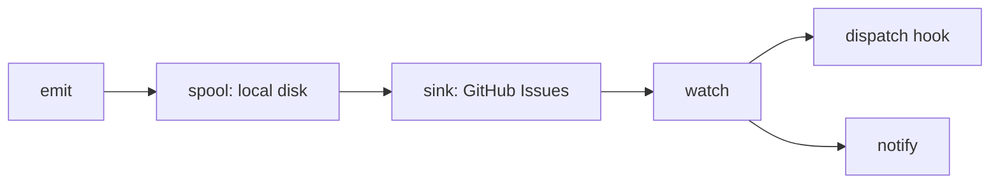

# errmeter

<div align="center">

[🇺🇸 English](https://github.com/caty-ai/errmeter/blob/main/README.md) ｜ **🇯🇵 日本語** ｜ [🇨🇳 简体中文](https://github.com/caty-ai/errmeter/blob/main/docs/i18n/README.zh.md) ｜ [🇹🇭 ไทย](https://github.com/caty-ai/errmeter/blob/main/docs/i18n/README.th.md)


[](https://github.com/caty-ai/errmeter/blob/main/LICENSE)


errmeter は、失敗したり応答が止まったりした AI エージェントや定期実行ジョブを報告するツールです。複数台のマシンで見逃されがちな不具合を、ひとつの共有掲示板（board）とあなたの復旧フック（repair hook）にまとめて届けます。

**消えない叫び。**

🔧 [エンジニアリング: アーキテクチャ](https://github.com/caty-ai/errmeter/blob/main/docs/architecture.md) ｜ 📘 [リファレンス: 契約仕様](https://github.com/caty-ai/errmeter/blob/main/docs/contract.md)

[心当たりはありませんか？](#pain) ｜ [できること](#what) ｜ [必要なもの](#requirements) ｜ [はじめかた](#start) ｜ [安全な理由](#safety) ｜ [もっと知る](#more) ｜ [ライセンス](#license)

</div>

---

<a id="pain"></a>

## 心当たりはありませんか？

複数台のマシンでジョブを動かしていると、「静かに止まっている」ことに気づきにくくなります。

- 夜間バッチが1週間前から止まっていたのに、今日まで気づかなかった。
- エージェントが深夜3時に失敗し、そのエラーは滅多に開かないマシンの中に残ったまま。
- 他のエージェントを監視するはずのノートパソコンが、そのときスリープしていた。
- 「直した」と誰かが言ったが、実際に何が起きたのか誰も追跡できない。

errmeter は、そうしたマシンたちに「何が起きたかを報告する共有の場所」をひとつ用意します。

---

<a id="what"></a>

## できること

エージェントはまずレポートをローカルディスクに書き込みます。転送役（forwarder）がネットワークが使える時にそれを届け、監視役（watcher）が失敗をあなたの復旧フックに渡します。



- 📣 **Emit（発信）** — 失敗を報告するか、「生きています」というハートビートを送ります。
- 💾 **Spool（待ち行列）** — 配信が確認されるまで、レポートをローカルに保持しておく仕組みです。
- 📮 **Sink（転送）** — レポートをあなたの非公開 GitHub Issues 掲示板に転送します。
- 👀 **Watch（監視）** — 失敗を引き取り、復旧フックを実行し、必要ならあなたにエスカレーションします。

同じエラーが繰り返し起きると同じ Issue にまとまるので、発生履歴と復旧結果を追跡できます。復旧フックと通知設定はあなた自身が用意するものです。errmeter 自体がコードを直したり、復旧用の PR をマージしたりすることはありません。

「まずディスクに書く」という設計には限界もあります。ストレージが枯渇するとレポートが失われることがあり、あふれた分は詳細が削られ、上限に近づくほどそれ以降の発生分が切り捨てられます。ループ（常駐プロセス）を持たないホストは、一定の猶予期間の間と次回の emit 実行時に再送を試みます。すべてのマシンが停止していれば、誰もあなたに通知できません。詳しくは [耐久性と損失の境界](https://github.com/caty-ai/errmeter/blob/main/docs/contract.md) を参照してください。

この共有掲示板を使うのに必要なのは、実行環境（ランタイム）、リポジトリ、そして権限を絞ったトークンだけです。

---

<a id="requirements"></a>

## 必要なもの

まずはエージェントを動かす1台のマシンに、次の3つを用意してください。

- **Node.js 18 以上** — パッケージの依存関係もビルド作業もデータベースも不要です。
- **非公開の GitHub リポジトリ** — たとえば `owner/errmeter-inbox` のようなものです。
- **細かく権限を絞ったトークン（fine-grained token）** — そのリポジトリの Issues とメタデータだけに限定します。

| 環境 | 対応状況 | 知っておくこと |
| --- | --- | --- |
| macOS | ✅ 対応済み | launchd によるネイティブ登録 |
| Linux（ユーザー権限の systemd） | ⚠️ 未検証 | ログイン時に起動・起動時実行にはユーザーのlingering設定が必要・実機での検証待ち |
| Linux（システム権限の systemd） | ⚠️ 未検証 | 実機での検証が必要 |
| Windows | ⚠️ 未検証 | ネイティブのタスクスケジューラ経路・実機での検証待ち |
| Node.js 18 / 20 / 22 / 24 | ✅ ローカルマトリクス | テストはローカルで実行・GitHub Actions は使用しません |
| コマンドを実行できる任意のプロセス | ✅ コマンドインターフェース | `errmeter emit` を呼び出すだけです |
| Claude Code | ✅ フック連携 | 導入者が設定するフック・詳細は連携ガイドを参照 |
| Codex | ✅ 通知連携 | 導入者が設定する通知フック・詳細は連携ガイドを参照 |
| cron / launchd ジョブ | ✅ ジョブラッパー | ジョブの終了ステータスをそのまま保持します |

検証方法については [ローカルマトリクス方針](https://github.com/caty-ai/errmeter/blob/main/CONTRIBUTING.md) を、導入者向けのツールについては [連携インデックス](https://github.com/caty-ai/errmeter/blob/main/docs/integrations/README.md) を参照してください。監視（`watch`）には常時起動しているマシンが必要ですが、エージェントだけを動かすホストなら、より軽い `agent-host` ループで済みます。

これらの前提条件がそろったら、インストールして最初のレポートを送ってみましょう。

---

<a id="start"></a>

## はじめかた

まず1台のマシンにインストールし、そのレポートを非公開掲示板につなげます。

### AI に頼んでインストールしてもらう

ふだん使っているエージェントに、次の内容を貼り付けてください。

```text
https://github.com/caty-ai/errmeter
Install this with: npm install -g errmeter — then help me configure it.
If npm is missing, follow the README's prerequisites and install guidance.
```

意図した npm パッケージと導入経路をエージェントが確実に使うよう、コマンドをそのまま書き出しています。

### 自分でインストールする

ターミナルを開いて、コマンドをインストールします。

```sh
npm install -g errmeter
errmeter --help
```

まず、非公開の受信用（inbox）リポジトリを作成してください。以下の `<owner>/<inbox>` は実際の名前に置き換えます（例: `owner/errmeter-inbox`）。山括弧（`<` `>`）はそのまま入力しないでください。

```sh
errmeter init --repo <owner>/<inbox> --role agent-host
```

細かく権限を絞ったトークンは、`~/.errmeter/github-token` にプレーンテキストで保存し、macOS/Linux ではファイルの権限（mode）を **0600**（自分のユーザーだけが読み書きできる設定）にしてください。Windows では `%USERPROFILE%\.errmeter\github-token` を使い、そのプロファイルの ACL（アクセス制御）を自分のユーザーだけに制限してください。トークンはシェル履歴やメッセージ、ログには残さないようにしましょう。

トークンを設置したら、アクセスできるか確認します。この確認コマンドはネットワークを使い、必要なラベルを作成し、確認用の Issue を作成してから閉じます。有効なトークンが必要です。確認コマンドだけでは「最小権限になっているか」までは証明できないので、トークンの権限設定画面もあわせてご自身で見直してください。

```sh
errmeter status --check
```

機密情報を含まない小さなログを `./last.log` として保存し、レポートを送ってみましょう。

```sh
errmeter emit --agent my-agent --message "something broke" --detail-file ./last.log
```

レポートはまずローカルにキューイングされ、配信は別途試みられます。終了コード 0 は「掲示板が受け取った」ことまでは保証しません。まだ監視役（watcher）が設定されていない新しい掲示板は、「degraded（低下）」というステータスを返すことがあります。アラートに頼る前に、[監視役とハートビートの設定](https://github.com/caty-ai/errmeter/blob/main/docs/integrations/heartbeat.md) を済ませ、復旧フックと通知の設定を行ってください。

<details>
<summary>トークンの設定・ファイルの場所・コマンドが見つからない場合</summary>

細かく権限を絞ったパーソナルアクセストークン（fine-grained personal access token）は、対象リポジトリと権限を自分で選べる GitHub の認証情報です。GitHub の開発者設定で、非公開の受信用リポジトリだけを選び、**Issues: Read and write**、**Metadata: Read** を設定してください。Contents や Pull requests の権限は不要です。詳しくは [トークンの権限境界](https://github.com/caty-ai/errmeter/blob/main/docs/contract.md#8-token-and-permission-boundary-frozen) を参照してください。

既定の保存場所は `~/.errmeter`（Windows では `%USERPROFILE%\.errmeter`）です。`ERRMETER_HOME` を設定している場合は、そのホームの `config.json` にある `sink.token_file` のパスにトークンを置いてください。`ERRMETER_GITHUB_TOKEN` を設定している場合はそちらが優先されます。POSIX 系のシステムではファイル権限編集ツールで mode 0600 に設定でき、Windows ではプロファイルのアクセス制御を代わりに使います。

npm が見つからない場合は、お使いの OS のインストーラーか、既存の Node バージョン管理ツールを使って Node.js 18 以上（npm 込み）を導入し、ターミナルを開き直してください。それでも `errmeter` が見つからない場合は、npm のグローバル実行ファイルのディレクトリが `PATH` に含まれているか確認してください。ターミナルとは、コマンドを貼り付けて使うアプリケーションのことです。macOS/Linux では「ターミナル」、Windows では「PowerShell」がこれにあたります。

</details>

最初のレポートがキューイングされたら、他のジョブをつなげる前に、各種の境界（限界）を確認しておきましょう。

---

<a id="safety"></a>

## 安全な理由

[契約仕様（contract）](https://github.com/caty-ai/errmeter/blob/main/docs/contract.md) が、次の境界を定めています。

- **あなたのエージェント** — emit はすぐに終了コード 0 を返します。CLI の誤用時は終了コード 2 を返します（§11）。
- **あなたのトークン** — 受信用リポジトリの Issues とメタデータだけに限定されます。権限設定は自分でも確認してください（§8）。
- **あなたのログ** — 送られるのはマスク処理済みの末尾部分だけです。既知の機密情報は隠されます（§4）。
- **あなたの選択** — `errmeter uninstall` を実行すると、起動時登録が削除されます（§11）。
- **あなたのマシン** — 常駐し続けるのは `watch` だけです。HTTP サーバーは動きません（アーキテクチャ §9）。

[導入者向けのフックツールはバックアップも復元します](https://github.com/caty-ai/errmeter/blob/main/docs/integrations/README.md)。起動時登録をアンインストールしても、フック自体や記録が消えるわけではありません。ホスティングされたサーバーも有料の CI も不要です。ノートパソコンは `agent-host` ループを動かすことも、それなしで emit だけ使うこともできます。機密情報のマスク処理はパターンに基づく仕組みなので、転送する前にログの内容をご自身でも確認してください。復旧フックは監視役（watcher）と同じ OS ユーザーとして実行され、そのフック自身の認証情報が別途必要です。

**次のような場合は、このツールは不要です。** マシンとエージェントがそれぞれ1つしかない場合や、すでにこのニーズをカバーする有料監視サービスを導入済みの場合です。

設定、運用上の制限、貢献方法については、以下の資料を参照してください。

---

<a id="more"></a>

## もっと知る

次に判断したいことに合わせて、参照先を選んでください。

| 知りたいこと | 参照先 |
| --- | --- |
| ユーザーストーリーと対象外の範囲 | [要件定義](https://github.com/caty-ai/errmeter/blob/main/docs/requirements.md) |
| データの流れとモジュール構成 | [アーキテクチャ](https://github.com/caty-ai/errmeter/blob/main/docs/architecture.md) |
| 設定・コマンド・各種の境界 | [契約仕様](https://github.com/caty-ai/errmeter/blob/main/docs/contract.md) |
| エージェントフック・ジョブラッパー・ハートビート | [連携ガイド](https://github.com/caty-ai/errmeter/blob/main/docs/integrations/README.md) |
| ローカルテストと貢献の手順 | [コントリビューションガイド](https://github.com/caty-ai/errmeter/blob/main/CONTRIBUTING.md) |
| 非公開の脆弱性報告 | [セキュリティポリシー](https://github.com/caty-ai/errmeter/blob/main/SECURITY.md) |
| README の各言語版 | [English](https://github.com/caty-ai/errmeter/blob/main/README.md) / [日本語](https://github.com/caty-ai/errmeter/blob/main/docs/i18n/README.ja.md) / [简体中文](https://github.com/caty-ai/errmeter/blob/main/docs/i18n/README.zh.md) / [ไทย](https://github.com/caty-ai/errmeter/blob/main/docs/i18n/README.th.md) |

---

<a id="license"></a>

## ライセンス

[MIT](https://github.com/caty-ai/errmeter/blob/main/LICENSE) ライセンスです。その通知事項と保証条件のもとで、errmeter を自由に使用・改変し、あなた自身のツールに組み込むことができます。

<div align="center">

**依存関係ゼロ** ｜ **Node 18 以上** ｜ **CI 不要**

</div>
