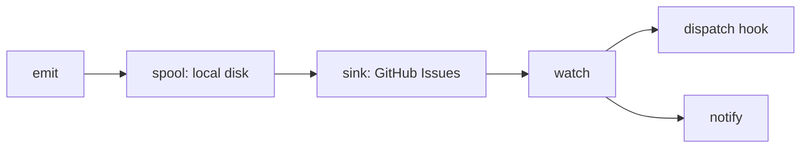

# errmeter

<div align="center">

[🇺🇸 English](https://github.com/caty-ai/errmeter/blob/main/README.md) ｜ [🇯🇵 日本語](https://github.com/caty-ai/errmeter/blob/main/docs/i18n/README.ja.md) ｜ [🇨🇳 简体中文](https://github.com/caty-ai/errmeter/blob/main/docs/i18n/README.zh.md) ｜ **🇹🇭 ไทย**


[](https://github.com/caty-ai/errmeter/blob/main/LICENSE)


errmeter รายงานเมื่อ AI agent หรืองานที่ตั้งเวลาไว้ล้มเหลวหรือเงียบหายไป เพื่อให้ความล้มเหลวที่ไม่มีใครสังเกตเห็นในหลายเครื่องมารวมกันที่บอร์ดกลางและ repair hook ของคุณ

**เสียงตะโกนที่ไม่มีวันหายไป**

🔧 [Engineering: สถาปัตยกรรม](https://github.com/caty-ai/errmeter/blob/main/docs/architecture.md) ｜ 📘 [Reference: ข้อตกลง (contract)](https://github.com/caty-ai/errmeter/blob/main/docs/contract.md)

[คุ้นเคยไหม?](#pain) ｜ [ทำอะไรได้บ้าง](#what) ｜ [สิ่งที่ต้องมี](#requirements) ｜ [เริ่มต้นใช้งาน](#start) ｜ [ทำไมถึงปลอดภัย](#safety) ｜ [เรียนรู้เพิ่มเติม](#more) ｜ [สัญญาอนุญาต](#license)

</div>

---

<a id="pain"></a>

## คุ้นเคยไหม?

การรันงานบนหลายเครื่องทำให้ความเงียบผิดปกติสังเกตได้ยาก

- งานที่รันทุกคืนหยุดไปตั้งแต่สัปดาห์ที่แล้ว แต่คุณเพิ่งมาสังเกตเห็นวันนี้
- agent ล้มเหลวตอนตีสาม ข้อผิดพลาดค้างอยู่ในเครื่องที่คุณแทบไม่ได้เปิดดู
- โน้ตบุ๊กของคุณกำลังหลับอยู่ ทั้งที่ควรจะคอยเฝ้าดู agent ตัวอื่น
- มีคนบอกว่าแก้ไขแล้ว แต่ไม่มีใครตามรอยได้ว่าเกิดอะไรขึ้นจริง ๆ

errmeter มอบพื้นที่กลางที่ใช้ร่วมกันให้เครื่องเหล่านั้นรายงานสิ่งที่เกิดขึ้น

---

<a id="what"></a>

## ทำอะไรได้บ้าง

agent จะเขียนรายงานลงดิสก์ในเครื่องก่อน จากนั้นตัวส่งต่อ (forwarder) จะส่งรายงานเมื่อเครือข่ายพร้อมใช้งาน และตัวเฝ้าดู (watcher) จะส่งต่อความล้มเหลวให้ repair hook ของคุณ



- 📣 **Emit (ส่งรายงาน)** — รายงานความล้มเหลว หรือส่งสัญญาณ "ยังทำงานอยู่" (heartbeat)
- 💾 **Spool (พักเก็บ)** — เก็บรายงานไว้ในเครื่องจนกว่าการส่งจะได้รับการยืนยัน
- 📮 **Sink (ส่งต่อ)** — ส่งต่อรายงานไปยังบอร์ด GitHub Issues ส่วนตัวของคุณ
- 👀 **Watch (เฝ้าดู)** — รับความล้มเหลวมาดูแล รัน repair hook ของคุณ และแจ้งเตือนคุณเมื่อจำเป็น

ข้อผิดพลาดที่เกิดซ้ำจะถูกจัดให้อยู่ใน Issue เดียวกัน ทำให้คุณตามรอยจำนวนครั้งที่เกิดขึ้นและผลของการแก้ไขได้ คุณเป็นผู้กำหนด repair hook และการตั้งค่าการแจ้งเตือนเอง errmeter เองไม่ได้แก้ไขโค้ดหรือ merge PR การแก้ไขให้

การออกแบบที่เขียนลงดิสก์ก่อนนี้ก็มีข้อจำกัด: พื้นที่จัดเก็บที่หมดลงอาจทำให้รายงานสูญหาย เมื่อล้นจะลดรายละเอียดลง และเมื่อใกล้ถึงเพดานก็จะเริ่มตัดรายการที่เกิดขึ้นต่อจากนั้นทิ้งไป โฮสต์ที่ไม่มีลูปทำงานต่อเนื่องจะพยายามส่งซ้ำในช่วงเวลาคงค้างที่จำกัด และในการ emit ครั้งถัดไป หากทุกเครื่องหยุดทำงานพร้อมกัน ก็จะไม่มีเครื่องไหนแจ้งเตือนคุณได้ ดู [ขอบเขตความคงทนและการสูญหายของข้อมูล](https://github.com/caty-ai/errmeter/blob/main/docs/contract.md)

บอร์ดกลางที่ใช้ร่วมกันนี้ต้องการเพียงรันไทม์ รีโพซิทอรี และโทเคนที่จำกัดสิทธิ์แคบ ๆ เท่านั้น

---

<a id="requirements"></a>

## สิ่งที่ต้องมี

เริ่มต้นบนเครื่อง agent เครื่องเดียวด้วยสามสิ่งนี้

- **Node.js 18 ขึ้นไป** — ไม่ต้องมีแพ็กเกจ dependency, ขั้นตอน build หรือฐานข้อมูล
- **รีโพซิทอรี GitHub ส่วนตัว** — เช่น `owner/errmeter-inbox`
- **โทเคนแบบจำกัดสิทธิ์ (fine-grained token)** — จำกัดเฉพาะ Issues และ metadata ของรีโพซิทอรีนั้น

| สภาพแวดล้อม | สถานะรองรับ | สิ่งที่ควรรู้ |
| --- | --- | --- |
| macOS | ✅ รองรับ | ลงทะเบียนผ่าน launchd โดยตรง |
| Linux (systemd ระดับผู้ใช้) | ⚠️ ยังไม่ได้ตรวจสอบ | เริ่มทำงานตอนล็อกอิน; การเริ่มตอนบูตต้องเปิด user lingering; รอการตรวจสอบบนเครื่องจริง |
| Linux (systemd ระดับระบบ) | ⚠️ ยังไม่ได้ตรวจสอบ | ต้องตรวจสอบบนเครื่องจริง |
| Windows | ⚠️ ยังไม่ได้ตรวจสอบ | ใช้ Task Scheduler ของระบบโดยตรง; รอการตรวจสอบบนเครื่องจริง |
| Node.js 18 / 20 / 22 / 24 | ✅ ทดสอบเมทริกซ์ในเครื่อง | รันเทสต์ในเครื่อง ไม่ใช้ GitHub Actions |
| กระบวนการใด ๆ ที่รันคำสั่งได้ | ✅ อินเทอร์เฟซแบบคำสั่ง | เรียก `errmeter emit` ได้เลย |
| Claude Code | ✅ เชื่อมต่อผ่าน hook | เจ้าของระบบตั้งค่า hook เอง ดูรายละเอียดที่หน้าการเชื่อมต่อ |
| Codex | ✅ เชื่อมต่อการแจ้งเตือน | เจ้าของระบบตั้งค่า notify hook เอง ดูรายละเอียดที่หน้าการเชื่อมต่อ |
| งาน cron / launchd | ✅ ตัวห่อหุ้มงาน (wrapper) | รักษาสถานะ exit ของงานเดิมไว้ |

[นโยบายการทดสอบเมทริกซ์ในเครื่อง](https://github.com/caty-ai/errmeter/blob/main/CONTRIBUTING.md) อธิบายวิธีการตรวจสอบ ส่วน [ดัชนีการเชื่อมต่อ](https://github.com/caty-ai/errmeter/blob/main/docs/integrations/README.md) อธิบายเครื่องมือสำหรับเจ้าของระบบ การเฝ้าติดตาม (monitoring) ต้องใช้ `watch` บนเครื่องที่เปิดอยู่ตลอดเวลา ส่วนโฮสต์ที่รันเฉพาะ agent สามารถใช้ลูป `agent-host` ที่เบากว่าได้

เมื่อเตรียมสิ่งที่จำเป็นเหล่านี้พร้อมแล้ว ก็ติดตั้งและส่งรายงานแรกของคุณได้เลย

---

<a id="start"></a>

## เริ่มต้นใช้งาน

ติดตั้งบนเครื่องเดียวก่อน แล้วค่อยเชื่อมต่อรายงานของเครื่องนั้นเข้ากับบอร์ดส่วนตัวของคุณ

### ให้ AI ช่วยติดตั้งให้

วางข้อความนี้ลงใน agent ที่คุณใช้งานอยู่

```text
https://github.com/caty-ai/errmeter
Install this with: npm install -g errmeter — then help me configure it.
If npm is missing, follow the README's prerequisites and install guidance.
```

คำสั่งถูกเขียนไว้อย่างชัดเจนเพื่อให้ agent ของคุณใช้แพ็กเกจ npm และวิธีการติดตั้งที่ถูกต้องตามที่ตั้งใจไว้

### ติดตั้งด้วยตัวเอง

เปิดเทอร์มินัลและติดตั้งคำสั่งนี้

```sh
npm install -g errmeter
errmeter --help
```

สร้างรีโพซิทอรีกล่องข้อความส่วนตัว (inbox) ของคุณก่อน แล้วแทนที่ `<owner>/<inbox>` ด้านล่างด้วยชื่อจริง (เช่น `owner/errmeter-inbox`) โดยไม่ต้องพิมพ์เครื่องหมายวงเล็บมุม

```sh
errmeter init --repo <owner>/<inbox> --role agent-host
```

บันทึกโทเคนแบบจำกัดสิทธิ์ของคุณไว้ที่ `~/.errmeter/github-token` เป็นข้อความล้วน โดยตั้งสิทธิ์ไฟล์เป็น **0600** บน macOS/Linux (ให้เฉพาะผู้ใช้ของคุณเท่านั้นที่อ่าน/เขียนได้) ส่วนบน Windows ให้ใช้ `%USERPROFILE%\.errmeter\github-token` และจำกัดสิทธิ์การเข้าถึงโปรไฟล์ (ACL) ไว้เฉพาะผู้ใช้ของคุณ อย่าให้โทเคนหลุดเข้าไปอยู่ในประวัติ shell ข้อความ หรือ log

เมื่อวางโทเคนแล้ว ให้ตรวจสอบสิทธิ์การเข้าถึง คำสั่งตรวจสอบนี้ใช้เครือข่าย สร้างป้ายกำกับ (label) ที่จำเป็น และสร้าง Issue ทดสอบแล้วปิดมันอีกครั้ง จึงต้องใช้โทเคนที่ใช้งานได้จริง แต่การตรวจสอบนี้พิสูจน์ไม่ได้ว่าสิทธิ์ถูกจำกัดไว้น้อยที่สุดจริง คุณควรตรวจดูหน้าตั้งค่าสิทธิ์ของโทเคนด้วยตัวเองด้วย

```sh
errmeter status --check
```

บันทึก log ขนาดเล็กที่ไม่มีข้อมูลอ่อนไหวไว้ที่ `./last.log` แล้วส่งรายงาน

```sh
errmeter emit --agent my-agent --message "something broke" --detail-file ./last.log
```

รายงานจะถูกจัดคิวไว้ในเครื่องก่อน ส่วนการส่งจะถูกพยายามแยกต่างหาก exit code 0 ไม่ได้ยืนยันว่าบอร์ดได้รับรายงานแล้ว บอร์ดที่เพิ่งสร้างใหม่อาจรายงานสถานะ degraded เพราะยังไม่มี watcher ที่รู้จัก ให้ทำ [การตั้งค่า watcher และ heartbeat](https://github.com/caty-ai/errmeter/blob/main/docs/integrations/heartbeat.md) ให้เสร็จ และตั้งค่า repair hook กับการแจ้งเตือนของคุณก่อนที่จะพึ่งพาการแจ้งเตือนจริง

<details>
<summary>ตั้งค่าโทเคน ตำแหน่งไฟล์ หรือหาคำสั่งไม่เจอ?</summary>

fine-grained personal access token คือข้อมูลรับรองของ GitHub ที่คุณเลือกเองได้ว่าจะให้สิทธิ์กับรีโพซิทอรีและสิทธิ์ใดบ้าง ในหน้าตั้งค่านักพัฒนาของ GitHub ให้เลือกเฉพาะรีโพซิทอรีกล่องข้อความส่วนตัวของคุณ พร้อมตั้งค่า **Issues: Read and write** และ **Metadata: Read** ไม่จำเป็นต้องมีสิทธิ์ Contents หรือ Pull requests ดู [ขอบเขตของโทเคน](https://github.com/caty-ai/errmeter/blob/main/docs/contract.md#8-token-and-permission-boundary-frozen)

โฟลเดอร์หลักตามค่าเริ่มต้นคือ `~/.errmeter` (บน Windows คือ `%USERPROFILE%\.errmeter`) หากคุณตั้งค่า `ERRMETER_HOME` ให้วางโทเคนไว้ที่ตำแหน่งที่ระบุใน `sink.token_file` ภายใน `config.json` ของโฟลเดอร์หลักนั้น หากตั้งค่า `ERRMETER_GITHUB_TOKEN` ไว้ ค่านี้จะมีความสำคัญเหนือกว่า เครื่องมือแก้ไขสิทธิ์ไฟล์สามารถตั้งค่าเป็น mode 0600 ได้บนระบบ POSIX ส่วน Windows จะใช้การควบคุมสิทธิ์การเข้าถึงโปรไฟล์แทน

หากไม่มี npm ให้ติดตั้ง Node.js 18 ขึ้นไปพร้อม npm โดยใช้ตัวติดตั้งของระบบปฏิบัติการของคุณ หรือใช้ตัวจัดการเวอร์ชัน Node ที่มีอยู่แล้ว จากนั้นเปิดเทอร์มินัลใหม่อีกครั้ง หากยังหา `errmeter` ไม่เจอ ให้ตรวจสอบว่าโฟลเดอร์ executable แบบ global ของ npm อยู่ใน `PATH` ของคุณหรือไม่ เทอร์มินัลคือแอปพลิเคชันที่ใช้วางคำสั่ง ได้แก่ Terminal บน macOS/Linux หรือ PowerShell บน Windows

</details>

เมื่อรายงานแรกถูกจัดคิวแล้ว ให้ตรวจสอบขอบเขตต่าง ๆ ก่อนที่จะเชื่อมต่องานอื่นเพิ่มเติม

---

<a id="safety"></a>

## ทำไมถึงปลอดภัย

[ข้อตกลง (contract)](https://github.com/caty-ai/errmeter/blob/main/docs/contract.md) กำหนดขอบเขตเหล่านี้ไว้

- **agent ของคุณ** — emit คืนค่ากลับอย่างรวดเร็วด้วย exit code 0 ส่วนการใช้ CLI ผิดวิธีจะคืนค่า 2 (§11)
- **โทเคนของคุณ** — จำกัดเฉพาะ Issues และ metadata ของกล่องข้อความ ควรตรวจสอบสิทธิ์ของโทเคนด้วยตัวเอง (§8)
- **log ของคุณ** — ส่งเฉพาะส่วนท้ายที่ปิดบังข้อมูลแล้ว ข้อมูลลับที่รู้จักจะถูกปิดบัง (§4)
- **ทางเลือกของคุณ** — `errmeter uninstall` จะลบการลงทะเบียนตอนบูตออก (§11)
- **เครื่องของคุณ** — มีเพียง `watch` เท่านั้นที่ทำงานต่อเนื่องระยะยาว ไม่มี HTTP server (สถาปัตยกรรม §9)

[เครื่องมือ hook ของเจ้าของระบบก็คืนค่าการสำรองข้อมูล (backup) ของตัวเองด้วยเช่นกัน](https://github.com/caty-ai/errmeter/blob/main/docs/integrations/README.md) การถอนการติดตั้งการลงทะเบียนตอนบูตไม่ได้ลบ hook หรือลบบันทึกของคุณ ไม่จำเป็นต้องมีเซิร์ฟเวอร์แบบโฮสต์หรือ CI แบบเสียเงิน โน้ตบุ๊กสามารถรันลูป `agent-host` หรือใช้ emit เพียงอย่างเดียวโดยไม่มีลูปก็ได้ การปิดบังข้อมูลอ่อนไหวทำงานตามรูปแบบ (pattern-based) ดังนั้นควรตรวจสอบเนื้อหา log ที่อ่อนไหวก่อนส่งต่อ ส่วน repair hook จะรันในฐานะผู้ใช้ระบบปฏิบัติการเดียวกับ watcher และต้องมีข้อมูลรับรองของตัวเองแยกต่างหาก

**ไม่เหมาะกับคุณหาก** คุณมีเพียงเครื่องเดียวและ agent เดียว หรือคุณมีระบบมอนิเตอร์แบบเสียเงินที่ครอบคลุมความต้องการนี้อยู่แล้ว

สำหรับการตั้งค่า ข้อจำกัดในการทำงาน และการมีส่วนร่วม ให้ดูข้อมูลอ้างอิงด้านล่าง

---

<a id="more"></a>

## เรียนรู้เพิ่มเติม

เลือกข้อมูลอ้างอิงตามสิ่งที่คุณต้องตัดสินใจต่อไป

| สิ่งที่คุณต้องการ | ที่ที่ควรดู |
| --- | --- |
| User story และสิ่งที่ไม่ใช่เป้าหมาย | [Requirements](https://github.com/caty-ai/errmeter/blob/main/docs/requirements.md) |
| การไหลของข้อมูลและแผนผังโมดูล | [Architecture](https://github.com/caty-ai/errmeter/blob/main/docs/architecture.md) |
| การตั้งค่า คำสั่ง และขอบเขตต่าง ๆ | [Contract](https://github.com/caty-ai/errmeter/blob/main/docs/contract.md) |
| Agent hook, job wrapper และ heartbeat | [Integrations](https://github.com/caty-ai/errmeter/blob/main/docs/integrations/README.md) |
| การทดสอบในเครื่องและขั้นตอนการมีส่วนร่วม | [Contributing](https://github.com/caty-ai/errmeter/blob/main/CONTRIBUTING.md) |
| การรายงานช่องโหว่แบบส่วนตัว | [Security policy](https://github.com/caty-ai/errmeter/blob/main/SECURITY.md) |
| README ฉบับภาษาอื่น | [English](https://github.com/caty-ai/errmeter/blob/main/README.md) / [日本語](https://github.com/caty-ai/errmeter/blob/main/docs/i18n/README.ja.md) / [简体中文](https://github.com/caty-ai/errmeter/blob/main/docs/i18n/README.zh.md) / [ไทย](https://github.com/caty-ai/errmeter/blob/main/docs/i18n/README.th.md) |

---

<a id="license"></a>

## สัญญาอนุญาต

[MIT](https://github.com/caty-ai/errmeter/blob/main/LICENSE) คุณสามารถใช้ ดัดแปลง และนำ errmeter ไปรวมกับเครื่องมือของคุณเองได้ ภายใต้ข้อกำหนดเรื่องประกาศสิทธิ์และการรับประกันของสัญญาอนุญาตนี้

<div align="center">

**ไม่มี dependency** ｜ **Node 18 ขึ้นไป** ｜ **ไม่ต้องใช้ CI**

</div>
